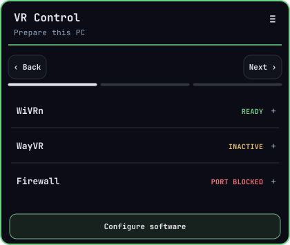
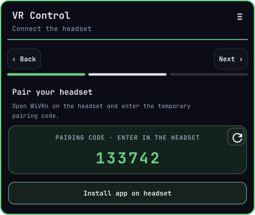
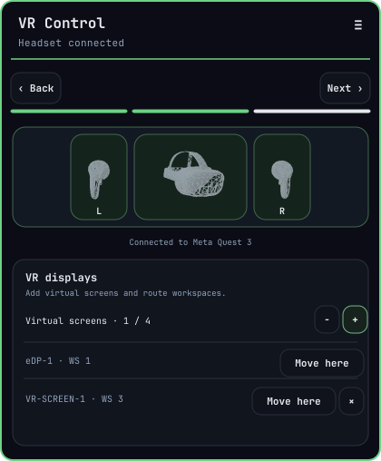

# Omarchy VR Control

Connect your standalone VR headset to your PC and use your Omarchy desktops, workspaces, and apps in VR. The setup guide helps you install the VR software and pair your headset with [**WiVRn**](https://github.com/WiVRn/WiVRn). Launch [**WayVR**](https://wayvr.org/) to bring your desktop screens into VR, check live connection status, manage firewall access for your private network, and create temporary virtual screens with workspace controls. Virtual screens require compatible capture support in WayVR.

<table>
  <tr>
    <td align="center"><a href="./screenshots/guide-page-1-prepare.png"></a></td>
    <td align="center"><a href="./screenshots/guide-page-2-pair.png"></a></td>
    <td align="center"><a href="./screenshots/guide-page-3-connection.png"></a></td>
  </tr>
  <tr>
    <td align="center"><em>1 · Prepare this PC</em></td>
    <td align="center"><em>2 · Connect the headset</em></td>
    <td align="center"><em>3 · Connection status</em></td>
  </tr>
</table>

## Features

- Install and configure [WiVRn](https://github.com/WiVRn/WiVRn), [WayVR](https://github.com/wayvr-org/wayvr), [XRizer](https://github.com/Supreeeme/xrizer), and [Avahi](https://github.com/avahi/avahi) from the setup guide.
- Request and display WiVRn's temporary headset pairing code.
- Start or stop the WiVRn server and WayVR overlay.
- Open or close the WiVRn firewall ports for private networks.
- Create temporary Hyprland headless displays and move the active workspace to a monitor. WayVR must support capture of the added output for it to appear as a VR screen.
- Open the headset app install page for supported manufacturers.
- View headset and controller artwork alongside the live headset connection status.

## Dependencies

- **[WiVRn](https://github.com/WiVRn/WiVRn)** connects the standalone headset to the PC and streams the VR session. The plugin uses its server, pairing flow, and connection status.
- **[WayVR](https://github.com/wayvr-org/wayvr)** brings desktop screens and apps into VR as interactive overlays. It can show physical displays and compatible virtual displays created for the session.
- **[XRizer](https://github.com/Supreeeme/xrizer)** lets OpenVR applications use the OpenXR runtime provided by WiVRn.
- **[Avahi](https://github.com/avahi/avahi)** advertises the PC on the local network so the WiVRn headset app can discover it.

## Requirements

- Omarchy with the Quickshell bar and a Hyprland session.
- `yay` for installing the AUR packages WiVRn, WayVR, and XRizer.
- UFW is optional. Firewall controls are disabled unless UFW is active.

Plugins run unsandboxed inside the Omarchy shell. Review the source before enabling it. The setup action installs software and enables the Avahi system service and WiVRn user service. Firewall changes require an explicit button click and a sudo prompt.

### Firewall permissions

Firewall controls manage UDP 5353 and TCP/UDP 9757 for private LAN ranges. The plugin adds only tagged rules and leaves other firewall rules unchanged.

On the first successful Open or Close firewall action, the plugin creates `/etc/sudoers.d/omarchy-vr-control`. This grants your account passwordless permission only to run `sudo /usr/bin/ufw status numbered`, allowing the panel to read firewall status without repeated password prompts. It does not grant passwordless permission to change firewall rules. Installing or enabling the plugin alone does not create this permission.

If that sudoers file already contains the expected permission, it is kept; otherwise, the plugin replaces it. Component cleanup offers to remove the plugin's firewall rules and this permission. Removing only the plugin does not remove them.

## Install

Install the plugin with Omarchy:

```sh
omarchy plugin add https://github.com/i3oot/vr-control.git --enable
```

The plugin defaults to the center bar section. To move it later:

```sh
omarchy bar move i3oot.vr --section center
```

## Use

Open **VR Control** from the bar. The guide offers PC preparation, headset pairing, and connection status. Once connected, launch WayVR from the plugin or let it start automatically when the headset connects.

The display controls are on page 3. Added Hyprland headless outputs and workspace moves last for the current Hyprland session.

The setup action installs `wivrn-dashboard`, `wayvr`, and `xrizer` from the AUR, installs [Avahi](https://github.com/avahi/avahi) through Omarchy, then enables Avahi and `wivrn.service`. The AUR install runs in a visible terminal so package prompts can be reviewed.

See [third-party notices](THIRD_PARTY_NOTICES.md) for bundled artwork credits, links, and licenses.

## Remove

Choose **Remove VR components…** from the plugin menu, or run the script below in a terminal. Setup records which packages and services were present before it ran and their state after setup. Removal shows that history alongside the current state, then asks separately whether to remove WiVRn, WayVR, and XRizer; Avahi; and the plugin's firewall rules and status permission. Firewall details are shown when available. Package managers show their normal dependency-removal prompts. Answers default to keeping components. Older installs without a history file are identified as unrecorded; the script still shows current state.

```sh
~/.config/omarchy/plugins/i3oot.vr/scripts/remove.sh
```

The script does not remove the plugin directory. After cleanup, remove the plugin with:

```sh
omarchy plugin remove i3oot.vr
```

A headless display created by the plugin lasts until it is removed or the Hyprland session ends.

## Development

Run the popup lifecycle regression tests with Node.js:

```sh
node tests/panel-lifecycle.test.cjs
```

The repository is organized by purpose: `scripts/` contains setup, removal, and firewall controls; `tools/` contains model conversion and GIF builders; `assets/` contains the bundled runtime artwork and source models; and `debug/` contains mock-state screenshot tooling. Regenerate the README mock-state screenshots with `python3 debug/render_guide_screenshots.py`, then build the marketplace's `preview.png` with `python3 tools/build_marketplace_preview.py` (requires `rsvg-convert`).

Regenerate the app's reduced-density wireframes by running `python3 tools/simplify_wireframe_meshes.py`, then `python3 tools/build_headset_gif.py` and `python3 tools/build_controller_gifs.py`. The original full-detail meshes are kept alongside the simplified derivatives. The simplifier needs Python VTK; GIF rendering needs OpenSCAD and FFmpeg. See [third-party notices](THIRD_PARTY_NOTICES.md) for artwork sources and licenses.
